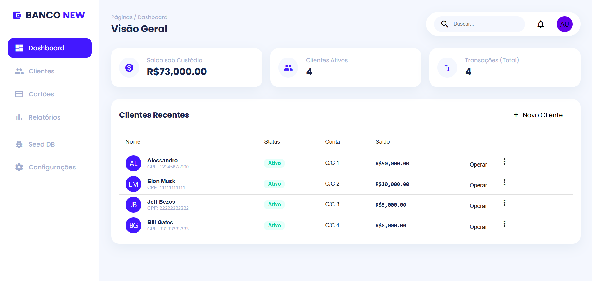
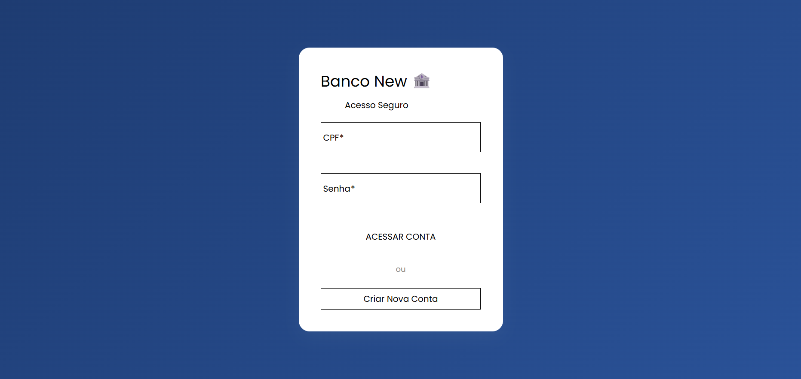

# 🏦 Banco New - Sistema Bancário Full Stack

  


Um sistema bancário moderno e completo, evoluído de um script CLI para uma arquitetura distribuída baseada em microsserviços, containerização e design system profissional.

---

## 📸 Screenshots

 *  - Dashboard
 *  - Tela de Login

---

## 🛠️ Tecnologias Utilizadas

### Backend (API & Regras de Negócio)

* **Python 3.12** com **FastAPI**
* **Strawberry GraphQL** (API tipada e moderna)
* **SQLAlchemy** (ORM para persistência de dados)
* **Auth JWT + Passlib** (Segurança e Criptografia)
* **Docker** (Containerização)

### Frontend (Interface & UX)

* **Angular 18+** (Standalone Components & Signals)
* **Angular Material 3** (Design System customizado)
* **Apollo Client** (Consumo de GraphQL com Cache)
* **Ng2-Charts** (Visualização de dados financeiros)
* **Guards & Interceptors** (Segurança de Rotas)

---

## ✨ Funcionalidades

* **🔐 Autenticação Segura:** Login com JWT e proteção de rotas.
* **💸 Operações Financeiras:** Depósitos e saques com validação de saldo e limites diários.
* **🔄 Transferências (PIX):** Transações atômicas entre contas (Tudo ou Nada).
* **📊 Dashboard Interativo:** KPIs em tempo real, gráficos de fluxo de caixa e gestão visual.
* **📑 Extrato Inteligente:** Histórico detalhado de movimentações.
* **⚙️ Configurações:** Ajuste dinâmico de limites de transação por usuário.
* **🐳 Infraestrutura:** Ambiente de desenvolvimento 100% Dockerizado.

---

## 🚀 Como Rodar o Projeto

> Você não precisa instalar Python ou Node.js localmente se tiver o **Docker**.

### Pré-requisitos

* Docker
* Docker Compose

### Passo a Passo

1. Clone o repositório:

```bash
git clone https://github.com/alessandrolsdev/banco-new.git
cd banco-new
```

2. Suba os containers (modo desenvolvimento):

```bash
docker-compose up --build
```

3. Acesse a aplicação:

* Frontend (App): `http://localhost:4200`
* Backend (GraphiQL / Playground): `http://localhost:8000/graphql`

### 🧪 Dados de Teste (Seed)

Para popular o banco com dados fictícios (ex.: Elon Musk, Jeff Bezos, usuários de teste):

* Acesse o Dashboard.
* No menu lateral, clique em **Seed DB**.
* Confirme a operação.

> Observação: se preferir rodar o seed via container, adicione um comando/entrypoint no `docker-compose` para executar o script de seed automaticamente ou rode uma task dentro do container backend:

```bash
# exemplo (ajuste conforme seu projeto)
docker-compose exec backend python scripts/seed_db.py
```

---

## 🏗️ Arquitetura

O projeto segue uma arquitetura separada (Monorepo):

```
/
├── backend/        # API Python (FastAPI + Strawberry)
│   ├── main.py     # Entrypoint
│   ├── schema.py   # Lógica GraphQL
│   ├── models.py   # Tabelas do Banco
│   └── auth.py     # Segurança
│
├── frontend/       # SPA Angular
│   ├── src/app/components  # Telas e Modais
│   ├── src/app/guards      # Proteção de Rotas
│   └── src/assets          # Imagens e Estilos
│
└── docker-compose.yml # Orquestração
```

---

## 🧩 Dicas de Desenvolvimento

* Use `docker-compose.override.yml` para ajustes locais (por exemplo, volumes com código fonte montado).
* Para desenvolvimento frontend, ative o live-reload do Angular dentro do container ou rode `ng serve` localmente apontando para a API via `proxy.conf.json`.
* Garanta que variáveis sensíveis (JWT_SECRET, DATABASE_URL) fiquem em `.env` e não sejam comitadas.

---

## ✅ Checklist antes de produção

* [ ] Revisar políticas de segurança e adicionar rate-limiting
* [ ] Ativar HTTPS e certificados (nginx / Traefik)
* [ ] Revisar limites e regras de negócio (limites diários, antifraude)
* [ ] Backups e migrações automatizadas
* [ ] Tests unitários e E2E

---

## ✍️ Contribuições

Contribuições são bem-vindas! Abra um *issue* ou envie um *pull request* com melhorias.

---

Made with 💜 by alessandrolsdev
